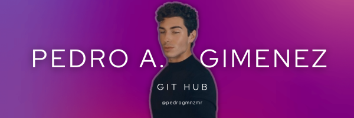

<h1 align="left">Bienvenid@ a mi GitHub</h1>

Hola soy Pedro Antonio Gimenez, estudiante de Administracion de Sistemas Informaticos en Red. Con experiencia en administracion de servidores web (nginx, apache, docker), desarrollo frontend (JS, css, WP, bootstrap) desarrollo backend (node, mysql, express). Y siempre con uns visión de mejora constante para mi futuro profesional. 

  

###

<h2 align="left">Frameworks, Lenguajes, CMS's, DB's, Servidores, CI/CD, CLI's</h2>

###

  
  
  
  
  
  
  
  
  
  
  
  
  
  
  
  
  
  
  
  
  
  
  
  
  
  
  
  
  
  
  
  
  
  
  
  
  
  
  
  
  
  
  
  
  
  
  
  
  
  
  
  
  
  
  

###

<h2 align="left">Mis estadísticas</h2>

###

  
  
  

###

<h2 align="left">Mis proyectos</h2>

###

  
s

###

<h2 align="left">Algo de lo que me inspira ahora</h2>

###

  

###

<picture>
  <source media="(prefers-color-scheme: dark)" srcset="https://raw.githubusercontent.com/tobiasmeyhoefer/tobiasmeyhoefer/output/github-snake-dark.svg" />
  <source media="(prefers-color-scheme: light)" srcset="https://raw.githubusercontent.com/tobiasmeyhoefer/tobiasmeyhoefer/output/github-snake.svg" />
  
</picture>

---

